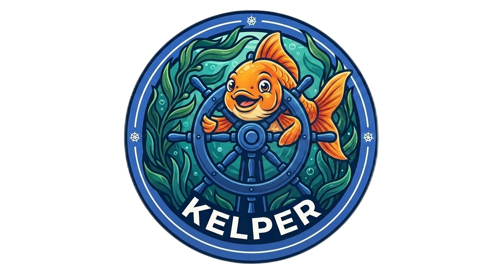

<p align="center">
  
</p>

# kelper

A Go binary that wraps `kubectl` with enhanced output formatting and cluster tooling. Zero external tool dependencies — works wherever `kubectl` works.

- **Decodes secrets** automatically on `get ... -o yaml` output.
- **Cleans up YAML** by stripping the noise Kubernetes injects (`uid`,
  `creationTimestamp`, `resourceVersion`, `status`, and per-kind defaults), so
  output is paste-ready for a manifest.
- **Healthcheck** — surface unhealthy pods and workloads (Deployments,
  StatefulSets, DaemonSets, Jobs, CronJobs) as tables with an exit code, or an
  interactive TUI when run bare.
- **Pod inspectors** — `images`, `resources`, and `volumes` render per-container
  detail with copy-paste-friendly indented YAML blocks.
- **Kubeconfig generation** — create readonly, admin, cluster-wide, or
  resource-scoped users via CSR + RBAC, either with flags or an interactive
  wizard.
- **Client-side api-server load balancing** — point a single context at a
  comma-delimited list of api-server endpoints and `kelper` will fail over to the
  next live one automatically.
- **Transparent passthrough** — anything kelper doesn't handle natively is
  forwarded straight to `kubectl`.

## Installing

### Pre-built binaries (recommended)

Grab the latest binary for your OS/arch from the
[Releases](https://github.com/jthunderbird/kelper/releases) page, then:

```bash
chmod +x kelper-linux-amd64
sudo mv kelper-linux-amd64 /usr/local/bin/kelper
alias k=kelper   # optional
k --help
```

### Container image (GHCR)

```bash
docker pull ghcr.io/jthunderbird/kelper:latest
docker run --rm -v ~/.kube:/root/.kube ghcr.io/jthunderbird/kelper:latest get pods -A
```

The image bundles `kubectl`, so it works standalone.

### From source

```bash
git clone https://github.com/jthunderbird/kelper.git
cd kelper
make build          # or: go build -o kelper ./cmd/kelper/
sudo make install   # installs to /usr/local/bin/kelper
alias k=kelper
k help
```

The original bash script is available as `kelper.sh` in the repo root as a
lightweight reference alternative.

## Shell Completion

The completion script must be **sourced** by your shell, not executed. To try it
in the current shell:

```bash
source <(kelper completion bash)     # bash (needs the bash-completion package)
source <(kelper completion zsh)      # zsh  (needs `autoload -U compinit && compinit`)
kelper completion fish | source      # fish
```

To install it permanently, use `--output` (`-o`) to write the script straight to
the right location:

```bash
kelper completion bash -o ~/.local/share/bash-completion/completions/kelper
kelper completion zsh  -o "${fpath[1]}/_kelper"
kelper completion fish -o ~/.config/fish/completions/kelper.fish
```

`powershell` is also supported. Without `--output` the script goes to stdout.

## Usage

`kelper` has a set of native commands and otherwise passes input straight
through to `kubectl`.

```bash
kelper <command> [args]            # run a native command
kelper <any kubectl args>          # anything else is forwarded to kubectl
kelper --kubeconfig <path> <args>  # use a specific kubeconfig
```

| Command       | Description                                                              |
| ------------- | ------------------------------------------------------------------------ |
| `healthcheck` | Report unhealthy pods and workloads (TUI when run with no target).       |
| `images`      | Show container images per pod.                                           |
| `resources`   | Show resource limits and requests per pod.                               |
| `volumes`     | Show volume mounts and pod volumes per pod.                              |
| `kubeconfig`  | Generate kubeconfig files for cluster users (wizard when run bare).      |
| `completion`  | Generate shell completion scripts (bash/zsh/fish/powershell).            |

Aliases: `health`; `image`/`imgs`/`img`; `resource`/`res`; `volume`/`vols`/`vol`.

## In action

### Secrets — auto-decoded

Any `get secret ... -o yaml` has its `data` base64-decoded and printed flush
left for easy copying:

```bash
$ kelper get secret -n kiali grafana-auth -o yaml
KEY: password
─────────────────────────
prom-operator
```

### `-o yaml` — cleaned up

For any non-secret `get ... -o yaml`, `kelper` removes the auto-mutated fields so
the result is ready to drop into a YAML file. Add `--raw` to bypass and get the
untouched `kubectl` output.

```bash
$ kelper get po -n flux-system helm-controller-678f5576df-g7scx -o yaml
apiVersion: v1
kind: Pod
metadata:
  labels:
    app: helm-controller
  name: helm-controller-678f5576df-g7scx
  namespace: flux-system
spec:
  containers:
    - image: docker.io/fluxcd/helm-controller:v1.4.0
      name: manager
      ...
```

### `images` — pods and their images

```bash
$ kelper images -n kyverno
pod: kyverno-admission-controller-5d8986c8b6-2g7gr (-n kyverno)
────────────────────────────────────────────────────────────────

  initContainers:
    kyverno-pre:
      image: registry1.dso.mil/ironbank/opensource/kyverno/kyvernopre:v1.13.4

  containers:
    kyverno:
      image: registry1.dso.mil/ironbank/opensource/kyverno:v1.13.4
```

### `healthcheck`

```bash
$ kelper healthcheck -n istio-operator
Unhealthy Workloads
NAMESPACE       KIND        NAME             AVAILABLE   DESIRED
istio-operator  Job         istiod-hook      0           1

Summary: 0 unhealthy pod(s), 1 unhealthy workload(s)
```

Run `kelper healthcheck` with no target to open the interactive TUI with a
namespace selector and live refresh.

### `kubeconfig`

Generates a client certificate, approves its CSR, creates matching RBAC, and
writes a ready-to-use kubeconfig.

```bash
kelper kubeconfig                 # launches the interactive wizard
kelper kubeconfig readonly        # cluster-wide readonly, generated username
kelper kubeconfig readonly --user john -n kyverno -o john-ro.yaml
kelper kubeconfig admin --user jane
kelper kubeconfig scoped --user ci -n build --resources pods,configmaps --verbs get,list
```

| Account type | Grants                                        |
| ------------ | --------------------------------------------- |
| `readonly`   | `get`, `list`, `watch` on everything          |
| `admin`      | full access                                   |
| `scoped`     | the `--resources`/`--verbs`/`--apigroups` you specify |

**Scope.** Accounts are **cluster-wide by default** (ClusterRole +
ClusterRoleBinding). Pass `--namespace`/`-n` to restrict the account to a single
namespace instead, which creates a Role + RoleBinding and sets that namespace as
the generated context's default.

**Username.** `--user` is optional. When omitted, a name of the form
`<type>-<8 hex chars>` is generated, e.g. `readonly-3f9a1c07`. A supplied
username must be a valid RFC 1123 subdomain, since it is embedded in the Role
and RoleBinding names.

**API groups.** For `scoped`, `--apigroups` defaults to `*`. Use `core` to
select the core (legacy, unnamed) API group — pods, services, configmaps and so
on: `--apigroups core,apps`.

Re-running for an existing username issues a fresh certificate and updates that
user's Role/RoleBinding in place.

## API-server load balancing

`kubectl` accepts one — and only one — `server:` per cluster in a kubeconfig.
If that endpoint is down, you are stuck. `kelper` lifts that limit: list multiple
api-server endpoints, comma-delimited, in the `server:` field, and `kelper`
probes them in order and uses the first one that is reachable.

### Configure it

```yaml
# ~/.kube/config
apiVersion: v1
kind: Config
clusters:
  - name: prod
    cluster:
      certificate-authority-data: <ca>
      # comma-delimited list of api-server endpoints
      server: https://10.0.0.1:6443,https://10.0.0.2:6443,https://10.0.0.3:6443
contexts:
  - name: prod
    context:
      cluster: prod
      user: prod-admin
current-context: prod
users:
  - name: prod-admin
    user:
      client-certificate-data: <cert>
      client-key-data: <key>
```

### How it behaves

On each kubectl passthrough invocation `kelper`:

1. Reads the current context's `server` field and splits it on commas.
2. Probes each endpoint in order (a 2s TCP dial).
3. Logs a line to stdout for every endpoint that is down and moves on.
4. Uses the first reachable endpoint by rewriting a temporary single-server
   kubeconfig and handing it to `kubectl`.
5. If every endpoint is exhausted, exits non-zero with a `not connected` error.

```bash
$ kelper get pods -n flux-system
api-server https://10.0.0.1:6443 unreachable (dial tcp 10.0.0.1:6443: i/o timeout); trying next endpoint...
api-server https://10.0.0.2:6443 reachable; using it
NAME                                READY   STATUS    RESTARTS   AGE
helm-controller-678f5576df-g7scx    1/1     Running   0          20h
```

A single (non-delimited) `server:` value behaves exactly as before — no probing,
no temp kubeconfig.

## Releases & images

Every push to `main` runs the [`release`](.github/workflows/release.yml)
workflow, which:

- cross-compiles `kelper` for linux/macOS (amd64 + arm64) and windows (amd64) and
  attaches them to a GitHub Release, and
- builds and pushes the container image to
  `ghcr.io/jthunderbird/kelper` (`:latest`, the release tag, and the commit SHA).

## License

See [LICENSE](LICENSE).
